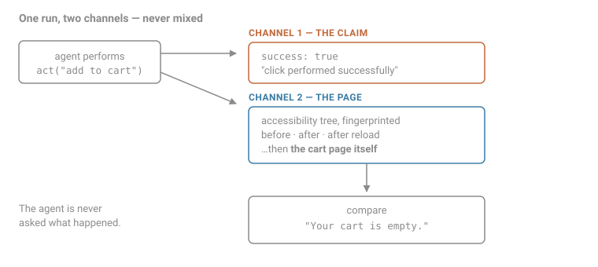

# agent-write-bench

**A browser agent reports `success`. The cart is empty.**

This measures how often that happens, on live retail sites, across models and architectures.



## The idea

When a browser agent performs a write — add to cart, submit a form, file a claim — the thing it checks is **its own action**, not the page. Frameworks report `success: true` when a click was *dispatched*, which is not the same as the click doing anything.

So the benchmark records two channels and never mixes them:

- **The claim** — what the framework said about each action, plus the agent's own end-of-run "is this done?"
- **The page** — accessibility trees, fingerprinted, before and after each action and after a reload

Then it does the thing nothing else does: **navigates to the page where the result actually lives** — the cart — and reads it. A product listing cannot tell you whether a cart changed.

## Results

| Model | Runs | **Tasks landed** | Framework-false | Agent-false |
|---|---|---|---|---|
| `claude-sonnet-5` | 9 | **3 of 9** | 1 | 0 |
| `jev-latest` | 9 | **3 of 9** | 4 | 0 |
| `gemini-flash-lite-latest` | 8 | **1 of 8** | 5 | 1 |
| `gemini-3.6-flash` | 5 | **1 of 5** | 2 | 0 |

- **Framework-false** — a click reported successful while the accessibility tree stayed byte-identical
- **Agent-false** — the agent said the task was done and the cart was empty

Per-run detail, with the evidence for every verdict: [`bench/results.md`](bench/results.md).

### What the numbers say

**Six of nine tasks silently failed on the strongest model tested.** Reported honestly — `not_done` almost every time — and the work still didn't happen, with no record either way.

**Failure rates fall sharply with model quality.** Framework-false ran ~40-50% of runs on the Gemini Flash models and 1 of 9 on Sonnet. A stronger model dismisses the overlay first and picks a better selector, so the situation that produces a dead click barely arises. An earlier version of this README claimed the rate was model-independent. That was wrong.

**A decision model matched the frontier model for 1/300th of the cost.** `jev-latest` landed the same 3 of 9 tasks as Sonnet — the same three, task for task — at $0.0039 against roughly $1.15. It gets there differently: four times as many dead clicks, and it never once recognised that it had finished.

**The sharpest single failure**, `allbirds-qty` on the weakest model, 7 steps:

> **Agent:** `done` — *"The cart displays the Men's Dasher NZ shoe with a quantity of 2."*
> **Cart page:** *"Your cart is empty."*

It really had navigated to that product. What it fabricated was the cart state — which is why half the claim checks out, and why nothing reading the agent's own output would catch it.

## Running it

Node 20+, from `bench/`:

```bash
npm install
echo 'BENCH_API_KEYS=your-key' > .env    # gitignored

node capture.mjs --task control-single-click --rep 1   # one run
npm run all                                            # every task
node summarize.mjs                                     # regenerate results.md
```

**Start with `control-single-click`** — one product page, one variant, one button. If that fails, the harness is broken rather than the agent. No result means anything until the control is green.

### Harnesses

| File | Drives with |
|---|---|
| `capture.mjs` | Stagehand + any allowlisted model (`anthropic/claude-sonnet-5`, `google/gemini-flash-lite-latest`, …) |
| `capture-jevonly.mjs` | [TypeSafe Jev](https://docs.typesafe.ai) only — element table built deterministically from the accessibility tree, no other model anywhere |
| `capture-tr.mjs` | Stagehand wrapped in [TrueReplay](https://github.com/solozerolabs/TrueReplay), recording its verdict next to independent ground truth — needs the extra install below |

`capture-tr.mjs` is the only harness with a dependency outside npm. TrueReplay is
not published and ships no build, so it has to be built from source:

```bash
git clone https://github.com/solozerolabs/TrueReplay.git
cd TrueReplay && npm install && npm run build
cd /path/to/agent-write-bench/bench && npm install ../../TrueReplay
```

Every other harness runs on `npm install` alone.

### Gemini free-tier trap

Limits are **per model** and the gap is 25×:

| Model | RPM | RPD |
|---|---|---|
| Flash models | 5 | **20** |
| **Flash Lite** (default) | 15 | **500** |

A run costs ~5 requests, so Flash allows four runs a day. Stagehand also retries 3× internally, so one throttled call burns three.

## Tasks

`bench/tasks.json` — 11 tasks, 2 skipped. Chosen for **invisible** failure rather than difficulty: modals over the button, region interstitials, client-side carts, sequential writes landing on a stale drawer. Each carries a `verify_url`, the page where the result lives. A task without one cannot be graded and is marked `skip`.

## Reading the results

Four rules `results.md` repeats, and they matter:

1. **No per-click percentages.** The loop re-issues the same instruction each step, so a stuck agent re-clicks and every repeat counts again. Per-run is the only safe unit.
2. **"Changed nothing" is a floor, not a rate.** A click can report success, move the page, and still add nothing.
3. **A changed page proves nothing.** Live retail sites mutate on their own — carousels, lazy images, modals.
4. **The agent's self-report is a claim, not evidence.** Recorded so it can be checked against the page, never used as the check.

Never merge rows from different models.

## Status

One rep per task, nine tasks, three sites, four model configurations. The control passes on all of them. **Nothing here is a rate yet.**
